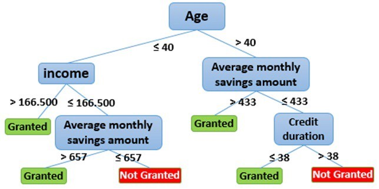

---
output:
  pdf_document: default
  html_document: default
---
# Decision Tree
```{r,message=FALSE, warning=FALSE}
library(rpart)
library(rattle)  
```


A decision tree is a flowchart-like structure in which each internal node represents a "test" on an attribute (e.g. whether a coin flip comes up heads or tails), each branch represents the outcome of the test, and each leaf node represents a class label (decision taken after computing all attributes). The paths from root to leaf represent classification rules.

Below it is an example of a decision tree for loan application. An applicant is evaluated at each node and branched into different branched based on the given rules. The end-node will then decide whether the application will be approved. For example, the first node (i.e., the first decision criteria) is whether the applicant is aged above or below 40. The applicant will be channeled to different branch based on this criteria. 

```{r pressure, echo=FALSE, fig.cap="Decision tree for loan application", out.width = '80%'}

```

In the prediction context, such decision tree can be used to predict, e.g., whether the applicant will default. The decision tree is very simple to understand and easy to interpret. The trees can be also visualized and provide insight on how the prediction model work. 

You may be wondering, how can we know what should be right decision rules, i.e., the structure of the decision tree? In fact, the optional decision tree is known to be computational impossible. Consequently, practical decision-tree learning algorithms are based on heuristic algorithms such as the greedy algorithm where locally optimal decisions are made at each node. 

When we are predicting a binary outcome, e.g., whether applicant will default, this is called classification problem. The corresponding tree is called decision tree. When we are predicting continous outcome, e.g., house price, that is called regression tree. 

In R, we can also construct decision tree using the rpart package. 
Let's first take a look at this famous problem of predicting who will survive from the Titanic. Refer to [kaggle](https://www.kaggle.com/c/titanic/overview) for more detailed information about this competition of predicting survival of Titanic passengers. 

```{r}
# load the training and test dataset
train <- fread('data/titanic/train.csv')
test <- fread("data/titanic/test.csv")
full=rbind(train, test, fill=TRUE)

head(full)

# clean data
table(full$Embarked)
full[Embarked=="", Embarked:="S"]   # replace missing Embarked with the most frequent value


## examine the cabin information
table(full$Cabin)
full[Cabin=="",Cabin:="N"]  # if Cabin is missing, replace with N
full[,Cabin:=str_extract(Cabin,"[:alpha:]")]   # extract the first letter of Cabin number
full[Cabin%in%c("G","T"),Cabin:="N"]           # Cabin G and T do not have enough observation and reset to "N"
table(full$Cabin)


# check the missing value pattern
summary(full)

# We have a lot of missing data in the Age feature (263/1309)
# examine rows with missing age
full[is.na(Age)] %>% head()
full=full[, Age2:=mean(Age,na.rm=TRUE)][is.na(Age), Age:=Age2][,-c("Age2")]  # replace missing age with average

# replace missing fare with average fare
full[is.na(Fare)]
full=full[, Fare2:=mean(Fare,na.rm=TRUE)][is.na(Fare), Fare:=Fare2][,-c("Fare2")]

# The title of the passenger can affect his survive:
# extract title 
full[,Title := gsub('(.*, )|(\\..*)', '', Name)]
full[Title %in% c('Mlle','Ms','Mme','Lady','Dona'), Title:= 'Miss'] 
full[Title %in% c('Capt','Col','Don','Dr','Jonkheer','Major','Rev','Sir','the Countess'), Title:= 'Officer']


# Let's see how many unique levels for each variables
apply(full,2, function(x) length(unique(x)))

# Group Parch and SibSp into categorical variables
table(full$Parch)
table(full$SibSp)
full[,Parch2:=ifelse(Parch>2,3,Parch), by=.(PassengerId)]
full[,SibSp2:=ifelse(SibSp>4,4,SibSp), by=.(PassengerId)]


# Let's move the features Survived, Pclass, Sex, Embarked to be factors
cols<-c("Pclass","Sex","Embarked","Title","Cabin","SibSp2","Parch2")
full[,(cols):=lapply(.SD, as.factor),.SDcols=cols]

full[,Survived:=factor(Survived,levels=c(0,1), labels = c("D","S"))]
summary(full)

```

Once we have cleaned our data, we can start to grow decision tree. 

```{r}
# grow tree
fit <- rpart(Survived ~ Pclass+Sex+Age+Fare+Cabin+Title,
   method="class", data=full)

printcp(fit) # display the results
plotcp(fit) # visualize cross-validation results
summary(fit) # detailed summary of splits
```

```{r}
# plot tree
fancyRpartPlot(fit)
```

Each node displays the proportion of death and survival, as well as the precent of the total samples. For example, in the root node (the node on the top), about 38\% of passengers will survive and 62\% of passengers will die. The decision split the root node based on the title of passenger. If a passenger has title start with "Mr" or "Officer", then they will be split to node 2. At node 2, the survival rate is only 16\%, while at node 3, the survival rate is 72\%. This makes sense because in the movie we see most crew sacrifice their lives to save others. 

At node 3, we really start to see how social status affect passenger's survival probability. Being a upper class significantly improve your survival probability. The survival probability for passenger of class 1 or 2 has survival probability of 95\%, while for average passenger the survival probability is only 48\%. This is the power of data speaking! 

```{r}
# confirm the survival rate
full[Title%in%c("Mr","Officer")]$Survived%>%table()
full[!Title%in%c("Mr","Officer")]$Survived%>%table()

# confirm the survival rate for social class
full[!Title%in%c("Mr","Officer") & Pclass %in% c(1,2) ]$Survived%>%table()

```


Let's take Boston house as an example. 

```{r}
Boston=fread("data/Boston.csv")
Boston[,location:=factor(location)]
Boston[,chas:=factor(chas)]


# grow tree
fit <- rpart(medv ~ lstat+chas+rm,
   method="anova", data=Boston)

printcp(fit) # display the results
plotcp(fit) # visualize cross-validation results
summary(fit) # detailed summary of splits

# plot tree
fancyRpartPlot(fit)

```


Similarly, let's examine the decision tree for Boston house price. At the top note, we have 506 houses and the average price is 23. Thus without additional information, our prediction of hourse price will be 23. Next, we split the house based on rm<6.9. For house with rm<6.9 (average number of rooms per dwelling<6.9), their average price will be 20, and for house with rm>=6.9, their average house price is 37. This makes a lot of sense since the size of a house is the most important factor in determining its value. 

We can verify the value of these house as follow:
```{r}
Boston$medv%>%mean()

Boston[rm>=6.9]$medv%>%mean()
```
